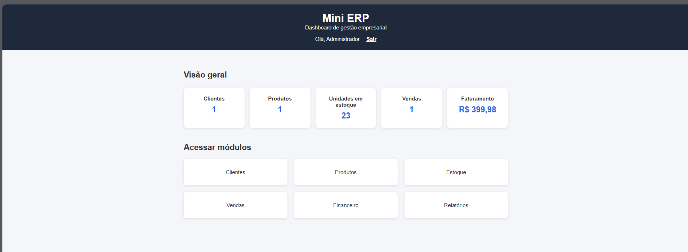
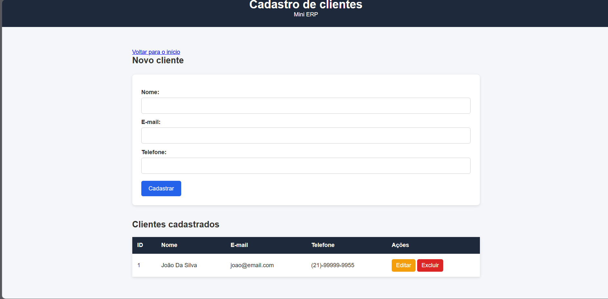
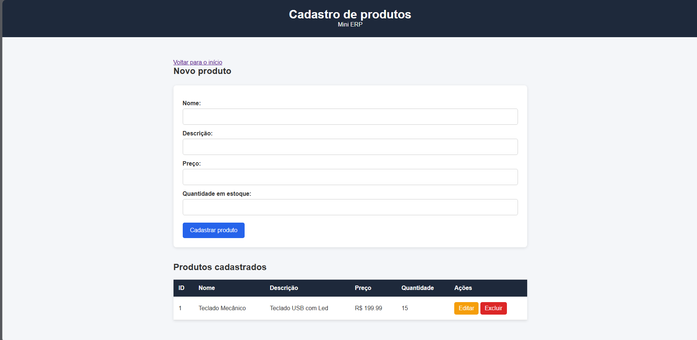
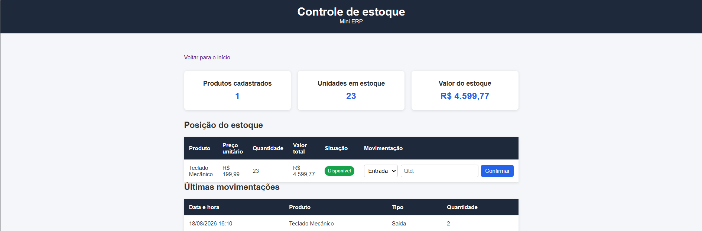
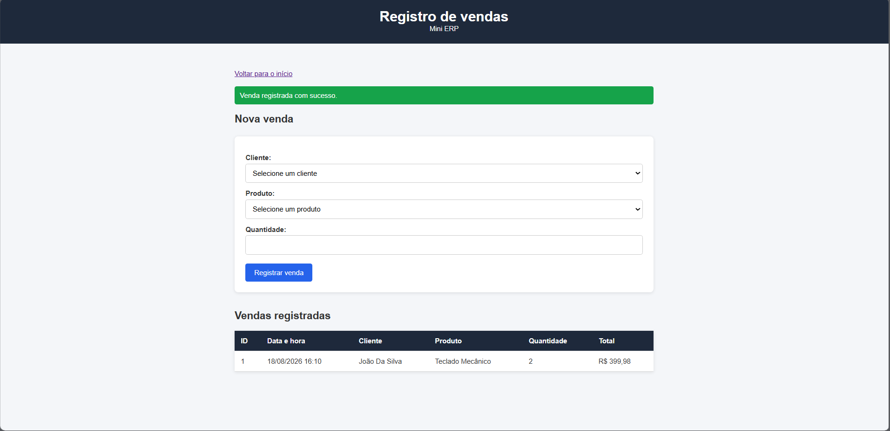
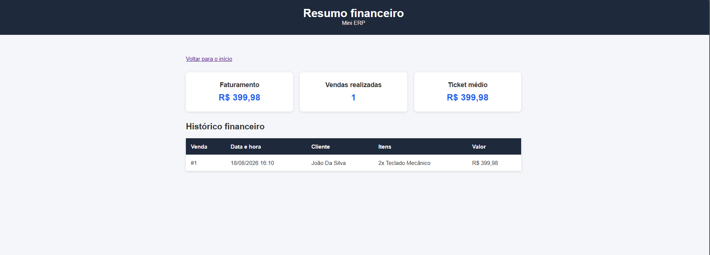
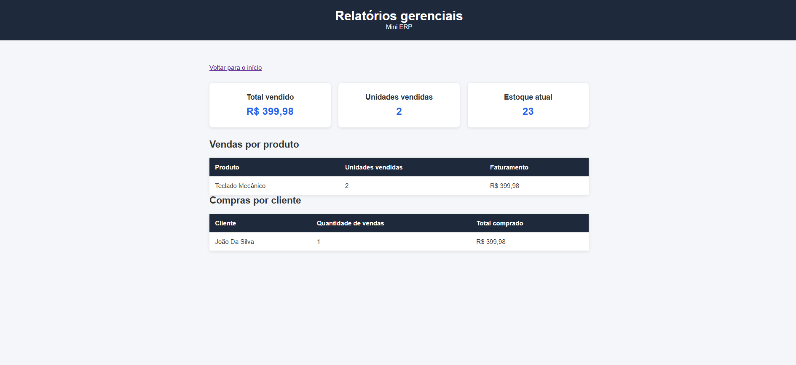
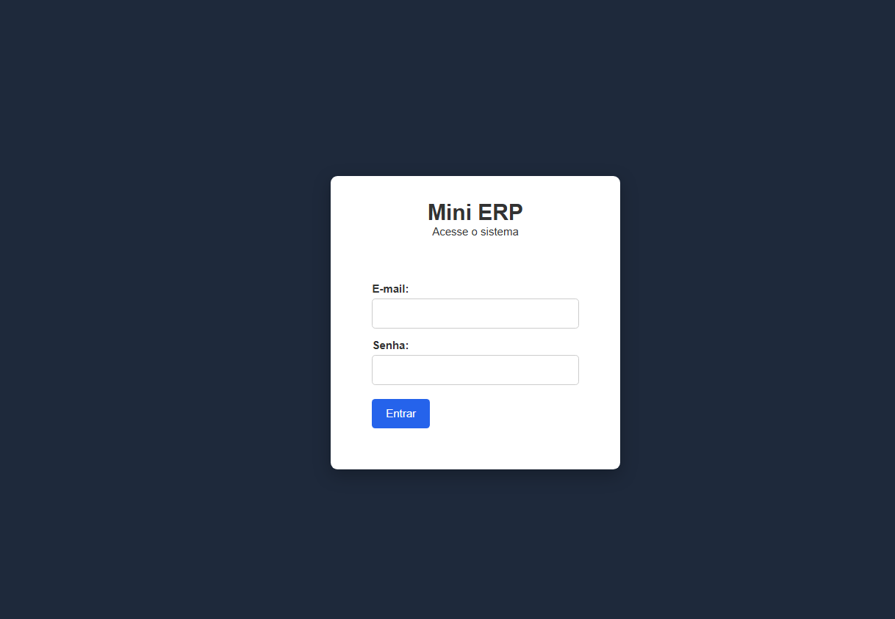

# Mini ERP

Sistema de gestão empresarial desenvolvido com Python, Flask e SQLite. O projeto integra clientes, produtos, estoque, vendas, financeiro e relatórios em uma aplicação web com autenticação.



## Funcionalidades

- Autenticação de usuário e proteção das rotas
- Dashboard com indicadores atualizados
- CRUD completo de clientes
- CRUD completo de produtos
- Controle de entrada e saída de estoque
- Histórico de movimentações
- Registro de vendas
- Baixa automática no estoque
- Resumo financeiro
- Relatórios por produto e cliente
- Validação contra estoque negativo
- Valores formatados no padrão brasileiro

## Tecnologias utilizadas

- Python
- Flask
- Flask-SQLAlchemy
- SQLite
- HTML5
- CSS3
- Jinja2
- Werkzeug

## Módulos

### Clientes

Permite cadastrar, consultar, editar e excluir clientes.



### Produtos

Cadastro e gerenciamento de produtos, preços e quantidades.



### Estoque

Controle de entradas e saídas, cálculo do valor armazenado e identificação de estoque baixo ou esgotado.



### Histórico de movimentações

Registro da data, produto, tipo e quantidade de cada movimentação.


### Vendas

Registro de vendas vinculado a clientes e produtos, com validação da quantidade disponível e baixa automática no estoque.



### Financeiro

Apresenta faturamento, quantidade de vendas, ticket médio e histórico financeiro.



### Relatórios

Consultas agrupadas com total vendido, unidades vendidas, estoque atual, vendas por produto e compras por cliente.



### Login

Autenticação com senha armazenada por meio de hash e proteção automática das páginas internas.



## Estrutura do projeto

```text
mini-erp/
├── docs/
│   └── images/
├── static/
│   └── css/
│       └── style.css
├── templates/
│   ├── clientes.html
│   ├── editar_cliente.html
│   ├── editar_produto.html
│   ├── estoque.html
│   ├── financeiro.html
│   ├── index.html
│   ├── login.html
│   ├── produtos.html
│   ├── relatorios.html
│   └── vendas.html
├── .gitignore
├── app.py
├── README.md
└── requirements.txt
```

## Como executar

### 1. Clone o repositório

```bash
git clone URL_DO_REPOSITORIO
cd mini-erp
```

### 2. Crie o ambiente virtual

```bash
python -m venv .venv
```

### 3. Ative o ambiente virtual no Windows

```powershell
.\.venv\Scripts\Activate.ps1
```

### 4. Instale as dependências

```bash
python -m pip install -r requirements.txt
```

### 5. Execute o sistema

```bash
python app.py
```

Abra no navegador:

```text
http://127.0.0.1:5000
```

## Acesso de demonstração

```text
E-mail: admin@minierp.com
Senha: admin123
```

O banco SQLite e o usuário administrador são criados automaticamente na primeira execução.

## Relacionamentos do banco de dados

- Um cliente pode possuir várias vendas.
- Uma venda pode possuir vários itens.
- Cada item de venda pertence a um produto.
- Um produto pode possuir várias movimentações de estoque.
- Uma venda reduz automaticamente a quantidade disponível.

## Objetivo do projeto

O Mini ERP foi desenvolvido como projeto de estudo e portfólio para aplicar conceitos de:

- Programação com Python
- Desenvolvimento web com Flask
- CRUD
- Banco de dados relacional
- Chaves estrangeiras e relacionamentos
- Autenticação e sessões
- Regras de negócio
- Integração entre módulos
- Consultas com `JOIN`, `SUM`, `COUNT`, `GROUP BY` e `ORDER BY`

## Autor

Desenvolvido por **José Henrique Sarro dos Santos**.

- GitHub: [Henriquemnj](https://github.com/Henriquemnj)